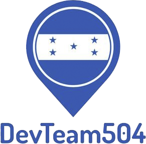
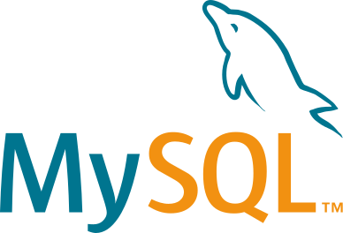
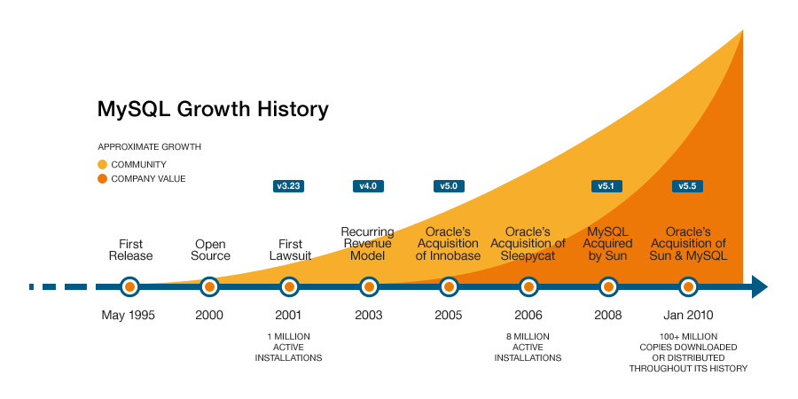

# Introducción a MySQL, MariaDB y SQLite

---
<!-- footer: 'Introducción a MySQL, MariaDB y SQLite' -->
<!-- paginate: true -->
<!-- backgroundColor: lightyellow -->


**Martin Nelbren Cuellar**
*Speaker DevTeam504*
:link: **nelbren.com**

---
<!-- backgroundColor: white -->


---
<!-- footer: 'Introducción a MySQL, MariaDB y SQLite' -->
<!-- backgroundColor: lightgray -->
<!-- _color: black -->

# Agenda

1. Conceptos generales de Bases de Datos
2. **MySQL** : *Historia* - *Productos*
3. **MariaDB** : *Bifurcación* - *Demostración*
4. **SQLite** : *Concepto* - *Demostración*
5. *Comparación* : **MariaDB** y **SQLite**

---

#### Conceptos generales de Bases de Datos

- **Base de Datos Relacional** es un conjunto de **tablas** en estructuradas en **registros** (filas) y **campos** (cols).
- Un **Sistema de Gestión de Bases de Datos Relacionales** (**RDBMS**), sigue el *modelo relacional*.
- El **modelo relacional**, es un modelo basado en la *lógica de predicados* y *teoría de conjuntos*.
- El **Mapeo Objeto-Relacional** (**ORM**) es una técnica de convertir datos de la **OOP** y el uso de **RDB** como motor de persistencia. **Fuente:** *wikipedia*

---
<!-- backgroundColor: white -->



## :link: [mysql.com](https://www.mysql.com/)

---

# ¿Qué es?

> **MySQL** es la base de datos de *código abierto* más popular del mundo. Ya sea una propiedad web de rápido crecimiento, un ISV tecnológico o una gran empresa, **MySQL** puede ayudarlo de manera rentable a entregar aplicaciones de base de datos escalables y de alto rendimiento.

---



**Fuente:** [History of MySQL](https://www.datasciencecentral.com/profiles/blogs/history-of-mysql)


---

## Productos MySQL

|Precios por|Standard Edition|Enterprise Edition|Cluster CGE|
|:--|--:|--:|--:|
|Subscripción anual|$2,000|$5,000|$10,000|

**Fuente:** [www.mysql.com/products](https://www.mysql.com/products)

---


## :link: [mariadb.org](https://mariadb.org/)

---

# ¿Qué es?

> **MariaDB** es uno de los servidores de bases de datos más populares del mundo. Está hecho por los desarrolladores originales de **MySQL** y se garantiza que seguirá siendo de **código abierto**. 

> Los usuarios notables incluyen **Wikipedia**, **WordPress** y **Google**.

**Fuente:** [About MariaDB Server](https://mariadb.org/about/)

---

## Historia de MariaDB

- **MariaDB** es una **bifurcación** (reemplazo directo) de **MySQL**. **MySQL** fue adquirida por **Sun Microsystems** en 2008. Luego, **Oracle** adquirió **Sun Microsystems** en 2010 con **MySQL** incluido.

- **Michael Monty Widenius** (el fundador de **MySQL**) decidió bifurcar **MySQL** y crear una empresa para él llamada Monty Program AB. Así nació **MariaDB** (**Maria** es el nombre de su  segunda hija).

---

- En *diciembre de 2012* se creó la **fundación MariaDB** para evitar cualquier adquisición de empresa como lo que había sucedido en el pasado con **MySQL**.

- **SkySQL** es una empresa compuesta por ex ejecutivos e inversores de MySQL que prestan servicios en torno a **MySQL** / **MariaDB**. En *abril de 2013*, se produjo una fusión entre **SkySQL** y **Monty Program AB**. 

---

- **MariaDB** tiene nuevas características interesantes: **mejores pruebas**, **mejoras de rendimiento** y **corrección de errores** que, lamentablemente, no están disponibles en **MySQL**. Por ejemplo, algunas optimizaciones provienen de **Google**, **Facebook**, **Twitter**, etc.


**Fuente:** [MariaDB High Performance](https://subscription.packtpub.com/book/application_development/9781783981601/1/ch01lvl1sec08/mariadb-history#)

---
<!-- backgroundColor: black -->
<!-- _color: black -->
<!-- footer: '' -->
<!-- paginate: false -->


---
<!-- backgroundColor: white -->
<!-- color: black -->
<!-- paginate: true -->
<!-- footer: 'Introducción a MySQL, MariaDB y SQLite' -->

- Instalación
  ```bash
  apt install -y mariadb-server
  ```
- Utilización
  ```bash
  mysql
  ```
- Operación
  - SHOW DATABASES;
  - use **nombre-de-base-de-datos**;
  - SHOW TABLES;
  - DESCRIBE **nombre-de-la-tabla**;

---

## Lenguaje de:

- Definición de Datos (**DDL**)
  - CREATE, ALTER, DROP
- Manipulación de Datos (**DML**)
  - SELECT, INSERT, UPDATE, DELETE
- Control de Datos (**DCL**)
  - GRANT, REVOKE
- Control de Transacción (**TCL**)
  - START TRANSACTION, COMMIT, ROLLBACK

---

**[bash](https://github.com/nelbren/intro_mysql_mariadb_y_sqlite/blob/master/bash/db_crear_bd.bash)**


**[python](https://github.com/nelbren/intro_mysql_mariadb_y_sqlite/tree/master/python)**


---


## :link: [sqlite.org](https://www.sqlite.org/)

---

# ¿Qué es?

> **SQLite** es una biblioteca en lenguaje C que implementa un motor de base de datos SQL pequeño, rápido, autónomo, de alta confiabilidad y con todas las funciones. **SQLite** es el motor de base de datos más utilizado del mundo. **SQLite** está integrado en todos los teléfonos móviles y en la mayoría de las computadoras y viene incluido dentro de innumerables otras aplicaciones que la gente usa todos los días. **Fuente:** [sqlite.org](https://www.sqlite.org)

---

A diferencia de la mayoría de las otras bases de datos SQL, **SQLite** no tiene un proceso de servidor separado. **SQLite** lee y escribe directamente en archivos de disco normales. Una base de datos SQL completa con múltiples tablas, índices, disparadores y vistas está contenida en un solo archivo de disco.

---
<!-- backgroundColor: black -->
<!-- _color: black -->
<!-- footer: '' -->
<!-- paginate: false -->


---
<!-- backgroundColor: white -->
<!-- color: black -->
<!-- paginate: true -->
<!-- footer: 'Introducción a MySQL, MariaDB y SQLite' -->

- Instalación
  ```bash
  apt install -y sqlite3
  ```
- Utilización
  ```bash
  sqlite3
  ```
- Operación
  - .tables
  - .schema **nombre-de-la-tabla**

---

**[bash](https://github.com/nelbren/intro_mysql_mariadb_y_sqlite/blob/master/bash/db_crear_bd.bash)**


**[python](https://github.com/nelbren/intro_mysql_mariadb_y_sqlite/tree/master/python)**


---

## Extras

**[sqlite-web](https://github.com/nelbren/intro_mysql_mariadb_y_sqlite/tree/master/sqlite/sqlite-web)**


**[python-rich](https://github.com/nelbren/intro_mysql_mariadb_y_sqlite/tree/master/mariadb/python-rich)**


---
<!-- backgroundColor: lightgray -->

# <!-- fit --> Conclusiones

---

- Los desarrolladores describen **MariaDB** como "*un reemplazo directo mejorado para **MySQL***". MariaDB está diseñado como un reemplazo directo de **MySQL** con más funciones, nuevos motores de almacenamiento, menos errores y mejor rendimiento. 

---

- Por otro lado, **SQLite** se detalla como "*una biblioteca de software que implementa un motor de base de datos transaccional SQL autónomo, sin servidor, sin configuración*". **SQLite** es un motor de base de datos SQL incorporado. 

**Fuente:** [MariaDB vs SQLite](https://stackshare.io/stackups/mariadb-vs-sqlite#:~:text=MariaDB%20is%20designed%20as%20a,%2C%20transactional%20SQL%20database%20engine%22.)

---
<!-- backgroundColor: white -->


## :link: [intro_mysql_mariadb_y_sqlite](https://github.com/nelbren/intro_mysql_mariadb_y_sqlite)

---
<!-- backgroundColor: black -->
<!-- _color: white -->
<!-- footer: '' -->
<!-- paginate: false -->

# :wrench: Herramientas usadas
- :package: [Visual Studio Code](https://code.visualstudio.com/)
- :gift: [Marp for VS Code](https://marketplace.visualstudio.com/items?itemName=marp-team.marp-vscode)
- :straight_ruler: [Marpit: Markdown slide deck framework](https://marpit.marp.app)
- :notebook: [Markdown Cheatsheet](https://github.com/adam-p/markdown-here/wiki/Markdown-Cheatsheet)
- :smile: [Emoji Cheat Sheet](https://www.webfx.com/tools/emoji-cheat-sheet/)